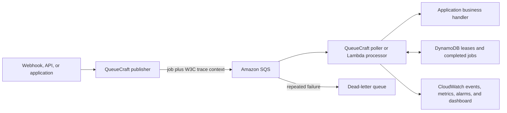

# QueueCraft

[](https://github.com/Yusuf-Karanib/QueueCraft/actions/workflows/ci.yml)
[](https://github.com/Yusuf-Karanib/QueueCraft/actions/workflows/aws-integration.yml)
[](https://www.npmjs.com/package/@yusufkaranib/queuecraft)
[](LICENSE)

QueueCraft is a TypeScript toolkit for moving slow or failure-prone work out of
web requests and into AWS SQS. It supplies the queue plumbing so an application
can publish a job, process it with bounded concurrency, retry failures, and
avoid repeating completed work.

QueueCraft is the reusable engine. It now has two different reference
applications: [YallaQueue](https://github.com/Yusuf-Karanib/YallaQueue) for
WhatsApp bookings and a business-neutral
[order-processing example](examples/order-processing/README.md). The second
example proves that QueueCraft is not tied to one application.

## Status

QueueCraft `0.3.0` is feature-complete for its portfolio scope and is maintained
for documentation, dependency, security, and correctness fixes. Its unit-tested
core and AWS infrastructure are usable for controlled pilots, but it has not
yet earned a production-ready claim.

Evidence: 83 automated tests, Node.js 20 and 22 CI, and an isolated real-AWS
workflow covering successful processing, duplicate suppression, failure,
dead-letter redrive, trace propagation, and stack cleanup. See the
[verification record](docs/verification.md).

Implemented:

- SQS publisher with caller-controlled idempotency keys
- Long-polling worker with bounded concurrency
- SQS-triggered Lambda batch processor with partial-message retries
- DynamoDB execution leases and completed-job duplicate suppression
- SQS visibility and DynamoDB lease heartbeats for long jobs
- Bounded graceful shutdown with handler cancellation
- CloudFormation for a standard queue, DLQ, DynamoDB table, IAM policies, alarms, and an optional private operations dashboard
- Guarded integration runner verified against real SQS and DynamoDB
- Automated isolated AWS integration tests with short-lived GitHub OIDC credentials
- Structured, payload-free lifecycle events for logs and metrics
- Buffered CloudWatch application metrics with bounded dimensions
- OpenTelemetry-compatible lifecycle tracing without payload attributes
- Active handler tracing so instrumented database and API calls can become child spans
- Opt-in W3C `traceparent`/`tracestate` continuation from publishers through SQS to workers
- Loopback-only queue dashboard with privacy-redacted DLQ replay
- Automated checks for Node.js 20 and 22
- Public npm package: `@yusufkaranib/queuecraft`

Deliberate limit:

- Messaging span links for batch processing and manual DLQ replay

## Try the demo in two minutes

Requirements: Git, Node.js 20 or 22, and npm. AWS credentials are not needed.

```bash
git clone https://github.com/Yusuf-Karanib/QueueCraft.git
cd QueueCraft
npm ci
npm run dashboard:demo
```

Open the local address printed in the terminal. The demo uses fake queue data,
stays on `127.0.0.1`, and cannot change AWS resources. It shows queue health,
redacted dead-letter messages, and guarded replay.


For the real-cloud evidence, open the passing
[AWS integration run](https://github.com/Yusuf-Karanib/QueueCraft/actions/runs/33528239353).
That run created an isolated SQS queue, DLQ, and DynamoDB table, exercised the
order example, and deleted the complete stack.

## Why SQS?

A webhook should respond quickly. It should not keep the sender waiting while
the application calls other services, writes several records, or sends a
message. QueueCraft separates those two jobs:

```text
webhook or API -> QueueCraft publisher -> SQS -> QueueCraft worker -> business logic
                                              |
                                              +-> DLQ after repeated failures
```

SQS standard queues provide at-least-once delivery. That means the same logical
job can arrive more than once. QueueCraft records execution state in DynamoDB
to reduce duplicate execution, but it cannot promise universal exactly-once
side effects. Handlers must still be safe to retry.

SQS redrive policy—not QueueCraft application code—moves repeatedly failing
messages to the DLQ.

## Architecture



QueueCraft owns the reusable queue behavior. Each application still owns its
payload rules and business action. DynamoDB reduces duplicate execution, while
SQS remains an at-least-once system; the business handler must still be safe to
retry.

## Install

```bash
npm install @yusufkaranib/queuecraft
```

Version `0.3.0` is the current public alpha. Pin the version for controlled pilots
and review the changelog before upgrading.

## Publishing a job

Use a stable identifier from the source event. For a WhatsApp webhook, use the
Meta message ID instead of generating a new value on every retry.

```ts
import { SQSClient } from "@aws-sdk/client-sqs";
import { QueueCraftPublisher } from "@yusufkaranib/queuecraft";

const publisher = new QueueCraftPublisher({
  sqsClient: new SQSClient({ region: process.env.AWS_REGION }),
  queueUrl: process.env.QUEUE_URL!,
});

await publisher.publish(
  {
    type: "booking_request",
    phoneNumber: "971500000000",
    requestedTime: "2026-09-01T15:00:00+04:00",
  },
  { idempotencyKey: whatsappMessageId },
);
```

When no idempotency key is supplied, QueueCraft generates a UUID. That is only
appropriate when the publish operation will never be retried as the same job.

## Processing jobs

```ts
import { DynamoDBClient } from "@aws-sdk/client-dynamodb";
import { SQSClient } from "@aws-sdk/client-sqs";
import {
  IdempotencyStore,
  QueueCraftPoller,
  Semaphore,
} from "@yusufkaranib/queuecraft";

const concurrency = 5;
const poller = new QueueCraftPoller({
  sqsClient: new SQSClient({ region: process.env.AWS_REGION }),
  queueUrl: process.env.QUEUE_URL!,
  semaphore: new Semaphore(concurrency),
  idempotency: new IdempotencyStore({
    client: new DynamoDBClient({ region: process.env.AWS_REGION }),
    tableName: process.env.IDEMPOTENCY_TABLE!,
  }),
  worker: {
    concurrency,
    pollIntervalMs: 250,
    shutdownTimeoutMs: 30_000,
  },
  handler: async (message, context) => {
    if (context.signal.aborted) return;
    const job = JSON.parse(message.Body ?? "null");
    await processJob(job, context.signal);
  },
  onError: (error) => console.error(error),
  onEvent: (event) => {
    const safeEvent = "idempotencyKey" in event
      ? { ...event, idempotencyKey: "[redacted]" }
      : event;
    console.log(JSON.stringify(safeEvent));
  },
});

await poller.start();
```

Call `await poller.stop()` during application shutdown. QueueCraft first lets
active handlers finish. When `shutdownTimeoutMs` expires, their `AbortSignal`s
are cancelled and the worker stops extending message visibility. A handler
that ignores its signal may keep running in application code, but `stop()` will
not wait forever and the DynamoDB lease can eventually expire.

## CloudWatch metrics and tracing

QueueCraft can turn the same payload-free lifecycle events into CloudWatch
metrics and OpenTelemetry-compatible spans:

Version `0.3.0` includes `QueueCraftActiveTracing`, W3C trace propagation, and
the optional AWS operations dashboard.

For the optional OpenTelemetry example, install its API in the application:

```bash
npm install @opentelemetry/api
```

Also configure an OpenTelemetry SDK, asynchronous context manager, and W3C
propagator. The API package by itself is a no-op.

```ts
import { CloudWatchClient } from "@aws-sdk/client-cloudwatch";
import {
  QueueCraftActiveTracing,
  QueueCraftCloudWatchMetrics,
  QueueCraftTracingObserver,
  QueueCraftW3CTraceContext,
} from "@yusufkaranib/queuecraft";
import { context, propagation, ROOT_CONTEXT } from "@opentelemetry/api";

const metrics = new QueueCraftCloudWatchMetrics({
  client: new CloudWatchClient({ region: process.env.AWS_REGION }),
  namespace: "queuecraft/dev",
  dimensions: { Service: "booking-worker" },
});
const tracing = new QueueCraftTracingObserver({ tracer });
const activeTracing = new QueueCraftActiveTracing({ tracer });
const traceContext = new QueueCraftW3CTraceContext({
  context,
  propagation,
  rootContext: ROOT_CONTEXT,
});

const onEvent = (event) => {
  metrics.onEvent(event);
  tracing.onEvent(event);
};
```

Pass `onEvent` to either the poller or Lambda processor. During shutdown, call
`await metrics.close()` and `tracing.close()`. Full setup and privacy limits are
in [`docs/observability.md`](docs/observability.md).

Pass `activeTracing` as the processor's `instrumentation` option. It makes work
started by the business handler part of the active trace context. Pass the same
`traceContext` to `QueueCraftPublisher` and to the poller or Lambda processor to
continue a producer's W3C parent through SQS. The application must configure
its OpenTelemetry SDK, context manager, and W3C propagator; the API alone is a
no-op. QueueCraft carries only `traceparent` and `tracestate`, never baggage.

## DynamoDB table requirement

The idempotency table uses a String partition key named `messageId`. DynamoDB
TTL should be enabled on the Number attribute `expiresAt`. Correctness does not
depend on immediate TTL deletion; lease takeover checks `leaseUntil` directly.

## Run the repository locally

To work on QueueCraft itself, use Node.js 20 or 22 and run:

```bash
npm ci
npm test
npm run typecheck
npm run build
```

The unit tests mock AWS. Passing them does not replace the guarded real-AWS
integration test.

A guarded real-AWS test runner is included in
[`docs/aws-integration-test.md`](docs/aws-integration-test.md). It must be run
against a dedicated test stack; it deliberately refuses to use a non-empty
queue. Its first passing AWS run is recorded in
[`docs/verification.md`](docs/verification.md). GitHub Actions now creates an
isolated stack, runs the guarded test, and deletes the stack on relevant changes
to `main`. The project remains alpha until it has evidence from controlled pilots.

## Deploy the AWS resources

The template and beginner deployment instructions are in
[`infrastructure/`](infrastructure/README.md). The template creates a standard
queue, DLQ, DynamoDB lease table, separate least-privilege publisher and worker
policies, and CloudWatch alarms.
The operations dashboard and sustained backlog alarm are opt-in so deploying
the default template does not silently add those two resources or their
possible CloudWatch charges.

See [`docs/observability.md`](docs/observability.md) for safe event logging and
suggested metrics. See
[`docs/yallaqueue-reference.md`](docs/yallaqueue-reference.md) for the first
end-to-end application built on QueueCraft. The independent
[`examples/order-processing`](examples/order-processing/README.md) application
is the second reference and is exercised by the guarded real-AWS workflow.

For a short case study, resume bullet, and recording script, see
[`docs/portfolio.md`](docs/portfolio.md).

## Local dashboard

The dashboard shows ready, in-flight, and dead-letter counts. It can replay a
failed standard-queue job only after a confirmation. It binds to your computer,
keeps AWS credentials on the server, and redacts likely customer fields.

See [`docs/dashboard.md`](docs/dashboard.md) for setup and safety limits.
Release steps are documented in [`docs/releasing.md`](docs/releasing.md).

## Maintenance scope

There is no active feature roadmap. New production-facing behavior should be
added only when a controlled pilot supplies a clear requirement and a way to
verify it. The current maintenance focus is keeping tests, dependencies,
documentation, and security guidance accurate.

## License

MIT
